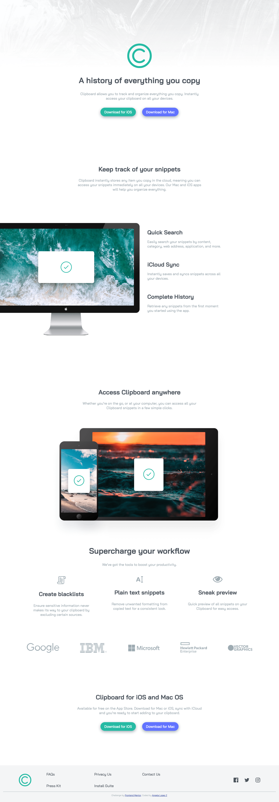

# Frontend Mentor - Clipboard landing page solution

## Table of contents

- [Overview](#overview)
  - [Screenshot](#screenshot)
  - [Links](#links)
- [My process](#my-process)
  - [Built with](#built-with)
- [Author](#author)

## Overview

### Screenshot

### Links

- Solution URL: [Github repo](https://github.com/glopzel/clippy-landing)
- Live Site URL: [Github Pages](https://glopzel.github.io/clippy-landing/)

## My process

### Built with

- Semantic HTML5 markup
- CSS custom properties
- Flexbox
- CSS Grid

## Author

- Frontend Mentor - [@glopzel](https://www.frontendmentor.io/profile/glopzel)
- Twitter - [@glopzel](https://www.twitter.com/glopzel)

